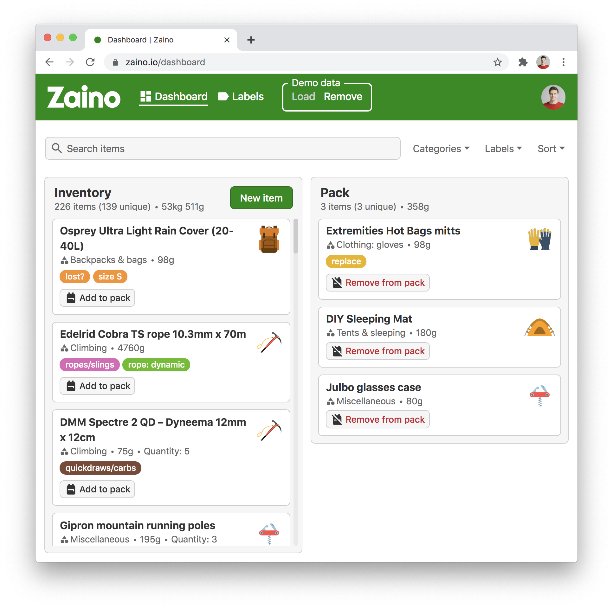

<h1 align="center">️🎒 Zaino</h1>
<h3 align="center">
  Hiking and mountaineering equipment app for the meticulous adventurer.
</h3>

<h4 align="center">
  <a href="https://zaino.io">Live demo</a> ᐧ <a href="https://github.com/igor-krupenja/zaino/issues">Issues</a> ᐧ <a href="https://github.com/igor-krupenja/zaino/blob/master/CHANGELOG.md">Changelog</a>
</h4>



## Overview

🚧🚧🚧 **Please note that Zaino is a work in progress.** 🚧🚧🚧

For instance, the app does not have a mobile version yet.

So far, the following features have been implemented.

- **Log-in with Google account**. Fast and secure log in with your Google account.
- **Data storage with Firestore**. Your data is safely stored in a Firestore database both with live demo and if you self-host Zaino.
- **Robust search and filtering**. Easily filter and sort your items by name, category, label, weight, etc.
- **Efficient packing for your next adventure**. Pack list offers a convenient overview of the items you want to take with you, including weight.
- **Flexible label system**. Organise your items in any way you want with custom labels.
- **Demo data**. Want to try the app without entering your own data first? Click Load under Demo data in header to populate your inventory with a comprehensive set of sample items. These can be easily removed later.
- **Self-hosting support**. Concerned about privacy and want to completely self-host your data? This is possible and I have provided a detailed guide in the [Setup](#setup) section below.

### Technologies used

- Typescript
- React, React Router, Redux
- Some React UI components: [React Select](https://react-select.com/home), [react-modal](https://github.com/reactjs/react-modal), [react-tiny-popover](https://github.com/alexkatz/react-tiny-popover)
- SCSS (no frameworks)
- Yarn workspaces
- Webpack
- Firestore, Firebase Authentication, Firebase Functions, Google Cloud Storage, Firebase Hosting

## Live Demo

A fully-functional live demo is available at [zaino.io](https://zaino.io). It uses a separate production Firebase project so your data is safe from me breaking something in development. 😅 Regular backups are also run there just in case.

Already have some document or spreadsheet with your hiking/climbing gear and want to try the app with your own data? Get in touch with with me at [igor.krupenja@gmail.com](mailto:igor.krupenja@gmail.com) and I will try to get a way to import your data into the app.

## Roadmap

### 0.2.0

- Add anonymous login.
- Learn more about unit testing React and create unit tests.
- Create a mobile-friendly app version. Yeah, I know, not having a mobile version sucks.
- Create a proper app logo.

Progress can be tracked in [Github projects](https://github.com/igor-krupenja/zaino/projects/1?card_filter_query=milestone%3A0.2.0).

## Changelog

### 0.1.1 (4th November 2020)

- Usability and styling improvements based on user feedback.
- Add privacy and cookie policy.

### 0.1.0 (15th October 2020)

- Initial release 🚀

[See full changelog](CHANGELOG.md).

## Development

### Contributing

Feel free to report any bugs and submit feature requests in the [Issues section](https://github.com/igor-krupenja/zaino/issues). PRs are also welcome — please read [Setup](#setup) below and if you require any assistance, give me a shout at [igor.krupenja@gmail.com](mailto:igor.krupenja@gmail.com).

### Code structure

The project code is split into several [packages](packages). Each package is a separate [yarn workspace](https://classic.yarnpkg.com/blog/2017/08/02/introducing-workspaces/) to facilitate easier imports, e.g. `import { Labels, Colors } from '@zaino/shared'`. This is the reason why yarn was chosen over npm for this project as npm's workspace support is [only in beta at the moment](https://blog.npmjs.org/post/626173315965468672/npm-v7-series-beta-release-and-semver-major).

In the future, this structure can be used to accomodate additional sub-projects (like a landing page or a React Native app) as separate packages. At the moment, the packages are are:

#### [shared](packages/shared)

A small (for the time being) amount of shared code (types). It also includes the demo data used in the app. The original in the CSV format is in [input-data.csv](packages/shared/src/demo-data/input-data.csv). It has been processed with a node script [processDemoData.ts](packages/shared/src/demo-data/processDemoData.ts), which can be modified and re-run with `yarn run process-demo-data`. Output data is in JSON format ([output-data.json](packages/shared/src/demo-data/output-data.json)) and is used by a Firebase function, see [below](####demo-data-and-firebase-functions).

#### [cloud-functions](packages/web-app)

A couple of Firebase cloud functions including the function that populates Firestore with the demo data.

#### [web-app](packages/web-app)

Main web app, code structure highlights:

- [src/components/](packages/web-app/src/components) App components and pages, along with per-component styles. Styles are mostly in SCSS and follow the BEM convention.
  - `Controls` Various reusable controls and form elements.
  - `Dashboard` Dashboard page components.
  - `Header` App header, including demo data loader.
  - `Icons` Several commonly re-used icons with applied styles.
  - `ItemModal` New/edit item modal components.
  - `LabelBadge` Fancy label badge components used throughout Dashboard and Labels pages.
  - `Labels` Labels page components.
  - `Misc` Various smaller components used throughout the app.
  - `Pages` App pages and temporary mobile placeholder.
  - `Selects` Core select component and re-useable and actual selects that use it. Note that the code is ugly here and needs refactoring, see [#346](/../../issues/346).
  - `Wrappers` Various wrapper components used purely to align and style child components.
- [src/constants/](packages/web-app/src/constants) Built-in label colors and categories, will be moved to Firestore when customisation of these is implemented.
- [src/firebase/](packages/web-app/src/firebase) Firebase initialisation and a couple of functions to work with Firestore data.
- [src/routes/](packages/web-app/src/routes) React Router config and routes.
- [src/state/](packages/web-app/src/state) State management with Redux.
- [src/styles/](packages/web-app/src/styles) Style variables and settings that apply to the whole app.

### Setup

This section outlines how to setup a development environment for Zaino. This involves quite a few steps, mostly to configure Firebase functionality.

Please note that the development setup has only been tested on macOS and Ubuntu Linux. If you encounter any problems on Windows, please [file an issue](https://github.com/igor-krupenja/zaino/issues/new).

#### Preparation

1. Install current (or LTS) Node.js or [use nvm](https://github.com/nvm-sh/nvm).
2. Install Yarn.
3. Clone the repo with `git clone https://github.com/igor-krupenja/zaino.git` or [fork it](https://docs.github.com/en/github/getting-started-with-github/fork-a-repo).
4. In the root of your cloned repo folder, run `yarn install`.

#### Firestore

Zaino is a serverless app that uses Firestore as a database. To use Firestore, you need to create a Firebase project and add its configuration to the repo:

1. Go to [Firebase console](https://console.firebase.google.com/u/0/) and create a new project.
2. In Firebase console for your newly-created project, click on the cogwheel, choose Project Settings, scroll down to Your apps and click Add app. Refer to this [article](https://support.google.com/firebase/answer/9326094) for additional information.
3. Choose **Web** app and follow the app setup workflow. On the last screen you will see some JS code. The key part here is the web app's Firebase configuration, similar to the _dummy_ data below:

```js
// Your web app's Firebase configuration
var firebaseConfig = {
  apiKey: 'AIzaSyD_GYhIIBfdFHvUDFpuIHQdSK7nio-dLM',
  authDomain: 'zaino-12345.firebaseapp.com',
  databaseURL: 'https://zaino-12345.firebaseio.com',
  projectId: 'zaino-12345',
  storageBucket: 'zaino-12345.appspot.com',
  messagingSenderId: '55797789077',
  appId: '1:570956282077:web:07ebe6d7e2b2ef01494f74',
  measurementId: 'G-P4N3TPO1XY',
};
```

4. In the root of the repository, create a file named `.env.development` (this file is gitignored for obvious reasons) and populate it with your Firebase configuration data from the previous step according to a template shown below. Make sure that you use the same variable names (`FIREBASE_API_KEY` etc.), this is important.

```env
FIREBASE_API_KEY="AIzaSyD_GYhIIBfdFHvUDFpuIHQdSK7nio-dLM"
FIREBASE_AUTH_DOMAIN="zaino-12345.firebaseapp.com"
FIREBASE_DATABASE_URL="https://zaino-12345.firebaseio.com"
FIREBASE_PROJECT_ID="zaino-12345"
FIREBASE_STORAGE_BUCKET="zaino-12345.appspot.com"
FIREBASE_MESSAGING_SENDER_ID="55797789077"
FIREBASE_APP_ID="1:570956282077:web:07ebe6d7e2b2ef01494f74"
FIREBASE_MEASUREMENT_ID="G-P4N3TPO1XY"
```

5. In the root of the repository, create a file named `.firebaserc` with the following content but replacing `zaino-12345` with your actual Firebase project name:

```json
{
  "projects": {
    "dev": "zaino-12345"
  }
}
```

6. Create a Firestore database in Firebase console for your project, a detailed guide is available [here](https://firebase.google.com/docs/firestore/quickstart).
7. Run `yarn run deploy-rules-dev` to deploy Firestore security rules.

#### Images and Google Cloud Storage

<!-- todo can skip? -->

**⚠️ Important.** This section can be skipped if you do not want to use category images.

Due to licensing restrictions (see [below](#license)), the images I use i the [live demo](#live-demo) of the app are not part of the repository and are hosted separately on Google Cloud Storage. If you run the app as is, it will display no images and show a bunch of 404 errors in console. Possible solutions:

- Host your own images in Google Cloud Storage. To do so, you will need to the following line to your `.env.development`, replacing the URL with the actual Google Cloud Storage URL for your project: `GCP_STORAGE_URL="https://storage.googleapis.com/zaino-12345.appspot.com"`. You would also need to add the images to a storage bucket for your Firebase project, the file structure I use is given below. The app will then pick up the images automatically.

```shell
├── categories
│   ├── backpack.svg
│   ├── boots.svg
│   ├── compass.svg
│   ├── gloves.svg
│   ├── gps.svg
│   ├── hat.svg
│   ├── hook.svg
│   ├── jacket.svg
│   ├── knife.svg
│   ├── pickaxe.svg
│   ├── poles.svg
│   ├── shorts.svg
│   ├── socks.svg
│   ├── stove.svg
│   └── tent.svg
└── mountain.svg <--- page loading indicator image
```

- Alternatively, you can just disable the images in [CategoryImage.tsx](packages/web-app/src/components/common/CategoryImage.tsx) and [index.html](packages/web-app/src/index.html)
- Another option would be to add your own image assets and import them with `file-loader` for Webpack. In addition to [CategoryImage.tsx](packages/web-app/src/components/common/CategoryImage.tsx) and [index.html](packages/web-app/src/index.html), check out [Categories.ts](packages/web-app/src/constants/Categories.ts) as well.

#### Demo data and Firebase functions

**⚠️ Important**. This section can be skipped if you do not want to use demo data or set up Firestore backups.

Unfortunately, Firestore apparently does not a have a meaningful way to import data, so to add the demo data to the app, I created a Firebase cloud function [addDemoDataDb.ts](packages/cloud-functions/src/addDemoDataDb.ts). There are extra steps necessary to use Firebase functions:

1. Install Firebase CLI globally with `yarn global add firebase-tools`.
2. Run `firebase login` and log in with your Google account. If you are getting the "command not found" error, make sure that [yarn is in your PATH](https://classic.yarnpkg.com/en/docs/install/).
3. Firebase functions are run by default in the `us-central1` region and _not_ the region of your Firebase project. To remedy this, add the following line to your `.env.development`: `FIREBASE_FUNCTIONS_REGION="europe-west1"`, replacing `europe-west1` with the region you prefer (likely the same region you set when creating a Firebase project).
4. Deploy functions to Firebase by running `yarn run deploy-fn-dev` in repo root directory.
5. [Install](https://cloud.google.com/sdk/install) Google Cloud SDK.
6. Run `gcloud login` and log in with your Google account.
7. Run `gcloud config set project PROJECT_ID`, replacing `PROJECT_ID` with your actual Firebase project ID.
8. Finally, run `gcloud pubsub topics create 'add-demo-data-db' && gcloud pubsub topics publish 'add-demo-data-db' --message 'dummy'`. This will create a Google Cloud Pub/Sub topic the [addDemoDataDb.ts](packages/cloud-functions/src/addDemoDataDb.ts) function is subscribed to and (securely) trigger the function.

Note that this will also deploy the [backupDb.ts](packages/cloud-functions/src/backupDb.ts) function which saves a backup of Firestore data very 24 hours to `GCP_STORAGE_URL` bucket you specify in your `.env.development` file. This can be disabled by simply removing the relevant export [here](packages/cloud-functions/src/index.ts).

#### Start development server

Woo-hoo, after so many steps you are now ready to start development! You can can run Webpack development server locally with `yarn start` in project root and access it at [http://localhost:8080/](http://localhost:8080/). Development server supports Hot Module Replacement for SCSS and React components (the latter with [React Refresh Webpack Plugin](https://github.com/pmmmwh/react-refresh-webpack-plugin)).

If you use VSCode as your editor, `yarn start` will actually run when you open the project in VSCode. If you do not like this behaviour, tasks can be edited or disabled in [tasks.json](.vscode/tasks.json).

#### Deployment and Firebase Hosting

Zaino comes pre-configured to support deployment to Firebase hosting. Zaino web app deployment uses a separate `.env` file called `.env.production`. You can either create a new Firebase project and use its configuration values in `.env.production`, or, for a quick check, just copy over the contents of `.env.development` to `.env.production` to use the same project in production mode as well. Additionally, you have to modify the `.firebaserc` to add the id of the project you want to use in production to the `prod key`:

```json
{
  "projects": {
    "dev": "zaino-12345",
    "prod": "zaino-prod-12345"
  }
}
```

If you opt to use the same Firebase project in production you already use for development, you only have to run `yarn deploy` in the project root. This will build a production Webpack bundle and push it to Firebase hosting. Your self-hosted Zaino instance can then be accessed online at the URL shown at the end of `yarn deploy` output.

If you opt to use a separate Firebase project in production, there are some additional steps necessary to add the demo data to the app:

1. Run `yarn run deploy-fn`.
2. Run `gcloud config set project PROJECT_ID`, replacing `PROJECT_ID` with your actual Firebase _production_ project ID.
3. Run `gcloud pubsub topics create 'add-demo-data-db' && gcloud pubsub topics publish 'add-demo-data-db' --message 'dummy'`.

#### Privacy and cookie policy

Zaino [live demo](#live-demo) has a privacy and cookie policy that is not a part of this repo and by default Webpack builds Zaino without the policies. If you want to build Zaino with your own privacy and cookie policies, you would need to:

- Add `PRIVACY_POLICY_ENABLED="true"` flag to a relevant .env flag (`.env.development` and/or `.env.production`).
- Create a `PrivacyPolicy` component that is used in [AppRouter.tsx](packages/web-app/src/routes/AppRouter.tsx).

## Acknowledgements

- Dmitri Shastin for his ideas and sharing his inventory data with me.
- Patrick Gillespie for his [Text to ASCII Art Generator](http://patorjk.com/software/taag/).
- The very good (and open source) [Material Design icons](https://material.io/resources/icons/).
- Github, Trello and Airtable as clean design inspirations.
- Astigmatic for the cool (and free) [Righteous font](https://fonts.google.com/specimen/Righteous?preview.text=Zaino&preview.text_type=custom).
- The development community for writing all the blog posts and Stack Overflow answers.
- All the people proving me with feedback.
- My awesome university classmates 💪

## License

Zaino is licensed under the [MIT license](LICENSE). However, this does not apply to the images I use in the [live demo](#live-demo). I have purchased these images (from [GraphicRiver](https://graphicriver.net/) and [Freepik](https://www.freepik.com/)) but obviously do not hold copyright for them and cannot include them in this repository.
